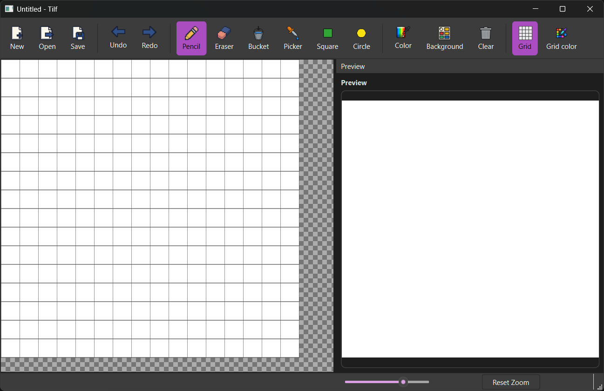
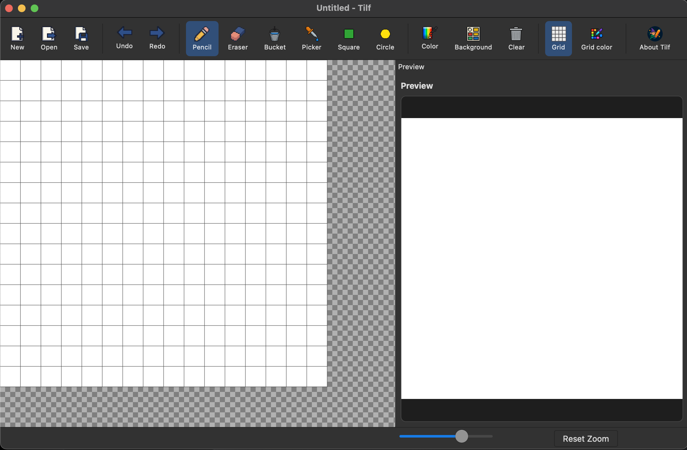
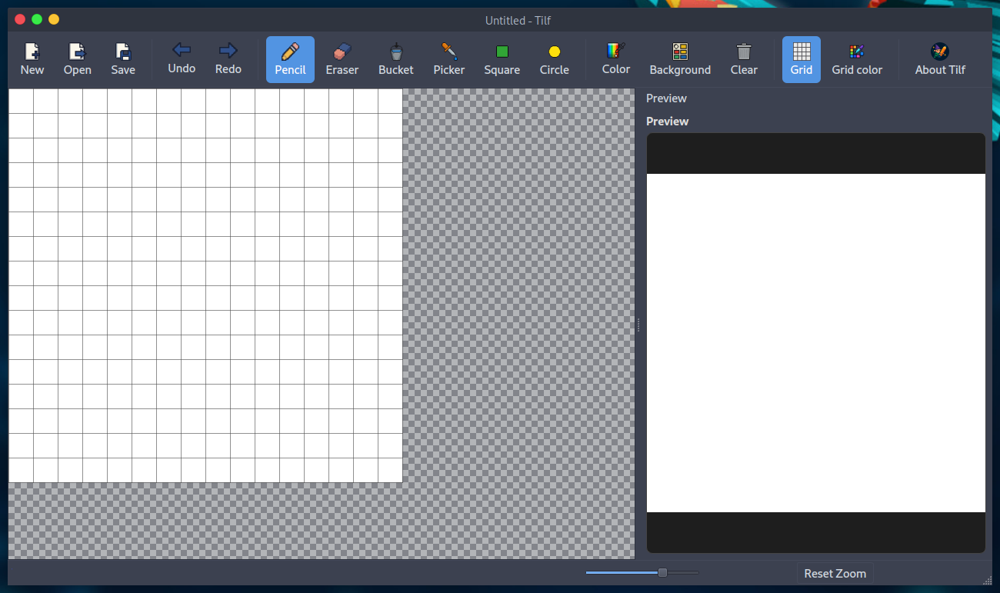

# Tilf — Pixel Art Editor


Tilf (Tiny Elf) is a simple yet powerful pixel art editor built with PySide6.
It’s designed for creating sprites, icons, and small 2D assets with essential drawing tools, live preview, undo/redo, export options and much more. Check [features](#features).

There are several Pixel Art Editors that do the same things and even much more (animations, etc...), 
but many require an account registration or the insertion of an e-mail or have a certain business model.

I'm _not_ interested in all that; my goal is to be able to create sprites freely, with (almost) zero dependencies, 
zero setup time, zero installations:

Tilf starts and I begin to draw what I want.

It runs on Windows, MacOS and GNU/Linux.

Download the latest release from the [releases page](https://github.com/danterolle/tilf/releases).

**Windows 11** -> [Download](https://github.com/danterolle/tilf/releases/download/v0.2/tilf_0.2-Windows.exe)

**MacOS 15.6** -> [Download](https://github.com/danterolle/tilf/releases/download/v0.2/tilf_0.2-MacOS.zip)

**GNU/Linux (ParrotOS 6.4)** -> [Download](https://github.com/danterolle/tilf/releases/download/v0.2/tilf_0.2-Linux.tar.xz)


I’m aware that the code quality isn’t great.
I didn’t prioritize it when writing this.
This project was something I put together during my spare time, and a lot of it could be written much better. 
There's definitely room for improvement, so I'm more than happy to accept PRs from anyone willing to contribute.

#### Why doesn't this tool have many commits?

Because I mainly used it for learning and personal purposes. 
Publish it as an Open Source project might be interesting for others as well.

## Table of Contents

- [Goals](#goals)
- [Features](#features)
- [Requirements](#requirements)
- [Build on MacOS and GNU/Linux](#build-on-macos-and-gnulinux)
- [About Windows](#about-windows)
  - [Run from source](#run-from-source)
  - [Build executable .exe](#build-executable-exe)
- [Keyboard Shortcuts for file operations](#keyboard-shortcuts-for-file-operations)
- [Save and Auto-Save](#save-and-auto-save)
- [Tips and Known Limits](#tips-and-known-limits)
- [Troubleshooting - Work In Progress](#troubleshooting---work-in-progress)
  - [ModuleNotFoundError: No module named 'PySide6'](#modulenotfounderror-no-module-named-pyside6)
- [Contributing](#contributing)
- [License](#license)
- [Contact](#contact)

## Goals

- Single executable (cross-platform)
- No accounts, no emails or registrations required
- Completely free/open source with all features unlocked
- Focused on small sprites and assets
- Works offline without internet connection. No online platforms.
- Almost zero dependencies: Python standard library + PySide6
- Zero installation or setup time needed

## Features

- Drawing tools:
  - Pencil
  - Eraser
  - Fill (bucket)
  - Eyedropper
  - Rectangle (stroke)
  - Ellipse (stroke)
- Canvas:
  - New image with custom dimensions
  - Zoom 1–50x (mouse wheel or slider)
  - Editable background color (alpha supported)
  - Optional grid with customizable color
  - Clear canvas
- Workflow:
  - Undo/Redo with history up to 50 states
  - Drag & drop images to open
  - Real-time preview in a side dock (you can move it wherever you want)
- Import/Export:
  - Open PNG, JPEG/JPG, BMP
  - Export to PNG (with or without transparency), JPEG/JPG, BMP 

### Handy details:

  - Hold Shift while drawing rectangles/ellipses to constrain to squares/circles
  - Grid is shown when zoom (cell size) is at least 4
  - Clicking a pixel with the foreground color switches to drawing with the background color. Otherwise, the foreground color is used. Holding down Alt or Option forces the use of the background color.

## Requirements

- Python 3, virtualenv
- OS: Windows, MacOS or GNULinux
- Dependencies:
  - PySide6
  - PyInstaller

I did not use uv or poetry for this project; 
I don't think it is necessary to introduce a tool of that kind for a project that is, all things considered, simple.

## Build on MacOS and GNU/Linux

1) Clone the repository:

```
git clone https://github.com/danterolle/tilf.git && cd tilf
```

2) This project has a [Makefile](https://github.com/danterolle/tilf/blob/main/Makefile) 
that automates all the necessary build and cleanup operations for Tilf (for MacOS and GNU/Linux only), so we just need to run:

```
make
```

3) The executable will be in the `dist` folder.

```
./tilf
```

Enjoy!

## About Windows

### Run from source

1) Clone the repository by using Git Bash:

```
git clone https://github.com/danterolle/tilf.git
```
```
cd tilf
```

2) Create a virtual environment:

```
py.exe -m venv env
```

3) Activate the virtual environment:

```
./env/Scripts/activate
```

4) Install the dependencies:

```
pip install pyside6 pyinstaller pillow
```

Note: 

5) And finally, run the application:

```
py.exe ./main.py
```

### Build executable .exe

1) Clone the repository by using Git Bash:

```
git clone https://github.com/danterolle/tilf.git
```
```
cd tilf
```

```
./env/Scripts/activate
```

2) Install the dependencies:
```
pip install pyside6 pyinstaller pillow
```

3) Run PyInstaller:

```
pyinstaller --name tilf --onefile --windowed --icon assets/icon.icns --add-data assets:assets --add-data style.qss:. main.py
```

4) The executable will be in the `dist` folder.

```
./tilf
```

## Keyboard Shortcuts for file operations

- File:
  - New: Ctrl+N
  - Open: Ctrl+O
  - Save: Ctrl+S
- Edit:
  - Undo: Ctrl+Z
  - Redo: Ctrl+Y
- Tools:
  - Pencil: B
  - Eraser: E
  - Bucket: G
  - Eyedropper: I
  - Rectangle: R
  - Ellipse: C
  - Use the background color: hold Alt/Option
- Shapes:
  - Constrain to square/circle: hold Shift

## Save and Auto-Save

- Export formats:
  - PNG: optionally keep transparency.
  - JPEG/JPG, BMP: no transparency.

On close, if there are unsaved changes, a recovery *.png* is automatically saved into a **tilf_autosaves**
folder next to the startup script, with a timestamped filename.

## Tips and Known Limits

- [Undo/Redo history is capped at 50 states to limit memory usage](https://github.com/danterolle/tilf/blob/main/pixel_canvas.py#L31).
- Large flood fills may take longer on big images.
- The grid appears when zoom (cell size) is at least 4.
- Very large images may impact performance; Remember: *Tilf targets compact pixel art and sprites*.

## Troubleshooting - Work In Progress

### ModuleNotFoundError: No module named 'PySide6'

Ensure your virtualenv is active and run: pip install pyside6

## Contributing

- Open issues for bugs or feature requests.
- For PRs, please keep the code style consistent and explain changes clearly.
- Feature ideas are welcome (e.g. advanced fills, selections, layers). Thank you!

## License

GPL v3.0, see the LICENSE file for details.

## Contact

- Developer: Dario 'danterolle' Camonita
- E-mail: danterolle@catania.linux.it
